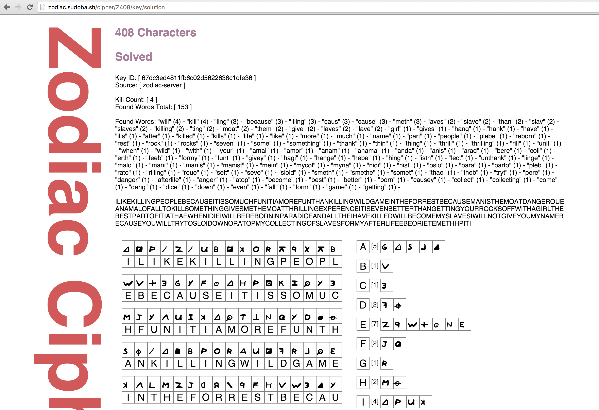

# zodiac
This is a personal project of mine to try and crack the unzolved Zodiac Killer ciphers, mainly the one commonly referred to as the "340 Cipher". It is built using Go and the Revel framework. My goal is to create a massive list of randomly generated cipher keys, and sort them by how many unique words were found in each solution. I hope to revise and apply the logic I am building to the 408 cipher until it returns what has been the accepted solution, and see what comes out when I apply that to the unsolved 340 cipher. 

**This project makes the following basic assumptions:**
* All symbols only translate to one letter. 
* Multiple symbols can represent the same letter. (i.e. commonly used letters)
* The Zodiac ciphers do contain errors, either intentional or accidental. 
* The method used to encipher all of the messages is homophonic simple substitution. 

**Completed:**
* Browser view of ciphers, with key and symbol to letter count
* Randomly generates cipher keys, accounting for a max number of symbols for each letter, and if a letter should be reused or not.

**Coming Up:**
* Find and count number of words in each solution generated by random key
* Index all randomly generated keys into ElasticSearch, with the word count and weights related to unique words
* Solve the 340 Cipher
* Profit? 

**Unsolved 340 Cipher:**

**Solved 408 Cipher:**

