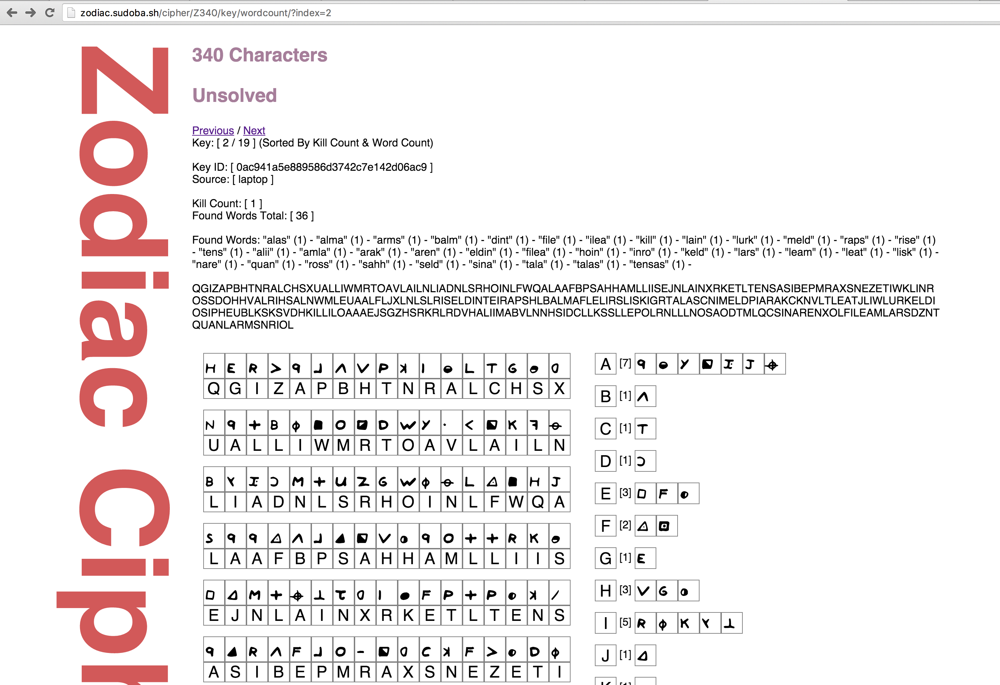

# zodiac
This is a weekend/evening project to try and crack the unzolved [Zodiac](https://en.wikipedia.org/wiki/Zodiac_Killer) ciphers using brute force, mainly the one commonly referred to as the 340 Cipher. Even if that doesn't happen, I've always wanted to make this. It is writtin in Go using the Revel framework and ElasticSearch. The plan is to create a list of randomly generated cipher keys, and sort them by how many unique words were found in each solution along with how many times the word "kill" was used. It is split into a server and client, with both sharing the "controllers" package since a lot of the code overlaps. 

The client generates a random key, and translates the cipher into a string. It then searches that string for the word "kill" (which was used 4 times in the 408 cipher). If the word "kill" exists, it counts how many times any of the 350,000+ words in the word list are in the string. The results are then packaged into a JSON object and sent to the server and stored under an md5 hash of the key. 

I ran an earlier version of this program that stored *all* solutions, which generated and tested over 10 million unique keys over the course of two days running on just my laptop. The exact number of possible keys is variable, since you can adjust how many symbols can be assigned to a single letter - but I am aware it is a rediculously high number. 

**This project makes the following assumptions:**
* All symbols only translate to one letter. 
* Multiple symbols can represent the same letter. (i.e. commonly used letters)
* The ciphers contain errors, either intentional or accidental. 
* The method used to encipher both messages is homophonic simple substitution.

**Ideas:**
* Write client in JS, for distributed browser based computing!
* Interface to create new messages and a password to decipher them.
* Markov Chain!

**Unsolved 340 Cipher:**

**Solved 408 Cipher:**

